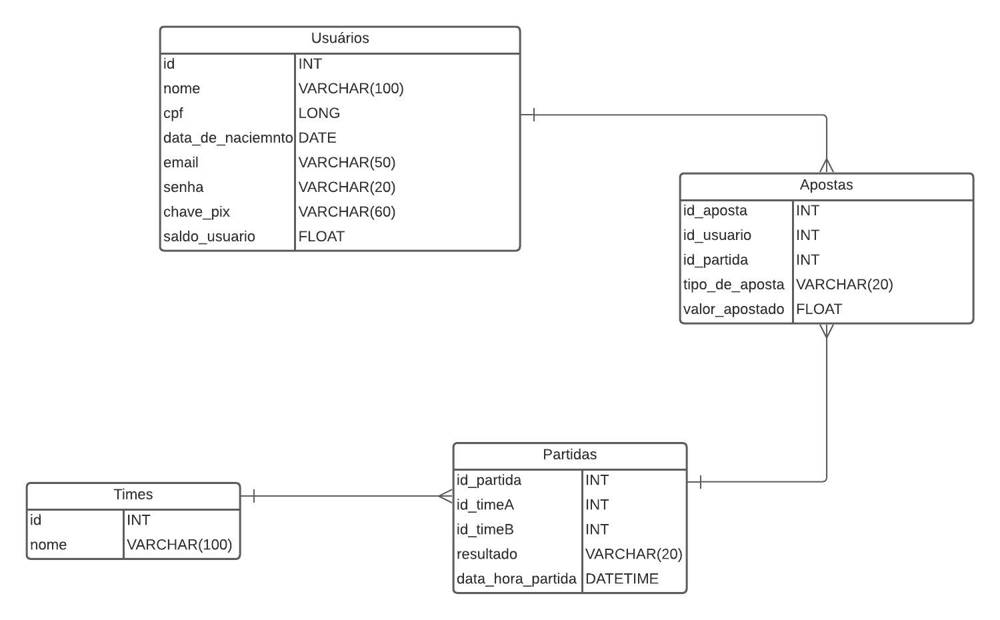

<h1 align="center">Diagrama de Entidade e Relacionamento</h1>

## Histórico de Versão

|    Data    | Versão |     Descrição     |                       Ator(es)                       |
| :--------: | :----: | :---------------: | :--------------------------------------------------: |
| 02/11/2022 |  0.1   | Adiciona diagrama | [Gabriel Marcolino](https://github.com/GabrielMR360) |

## Banco de Dados

O banco de dados utilizado para a api é o MySQL, foi escolhido esse banco pela sua facilidade de aprendizado e pela familiaridade que os membros do grupo tem com ele.

## Diagrama

