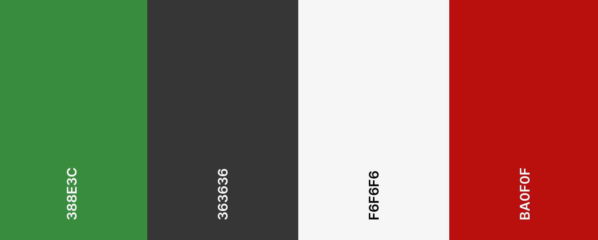

<h1 align="center">Identidade Visual</h1>

## Histórico de Versão

|    Data    | Versão |                    Descrição                    |                       Ator(es)                        |
| :--------: | :----: | :---------------------------------------------: | :---------------------------------------------------: |
| 14/10/2022 |  0.1   | Adicionando versão inicial da identidade visual | [Gabriel Marcolino](https://github.com/GabrielMR360), [Amanda Luiza](https://github.com/amandailg), [Carla Vitoria](https://github.com/Carla-Vitoria), [Júlio Batista](https://github.com/iamjuliobatista), [Alexandre](https://github.com/Alexandrecode)|

## Cores

### **Cores principais**

    

        <b>#388E3C</b>
    

   

Utilizada em elementos de navegação.

    

        <b>#363636</b>
    

  

Utilizada como cor de fundo.

### **Cores secundárias**

    

        <b>#F6F6F6</b>
    

  

Utilizada nas fontes.

    

        <b>#BA0F0F</b>
    

 

Utilizada para mensagens de erro ou alertas.

## Tipografia

Para a tipografia foi escolhida a fonte **Nunito**

## Icones