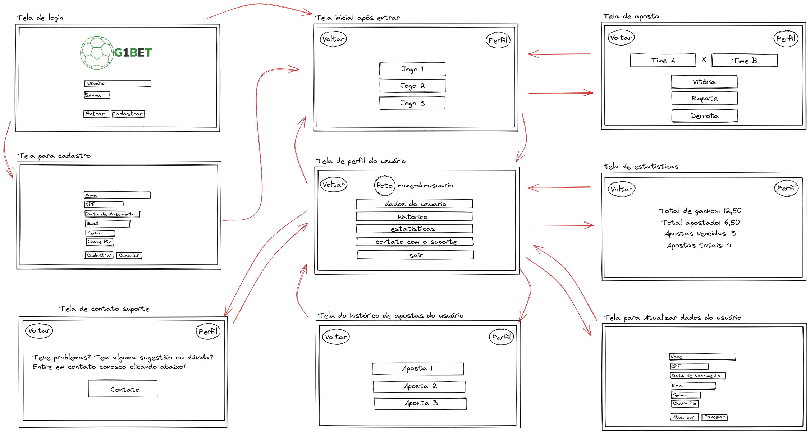
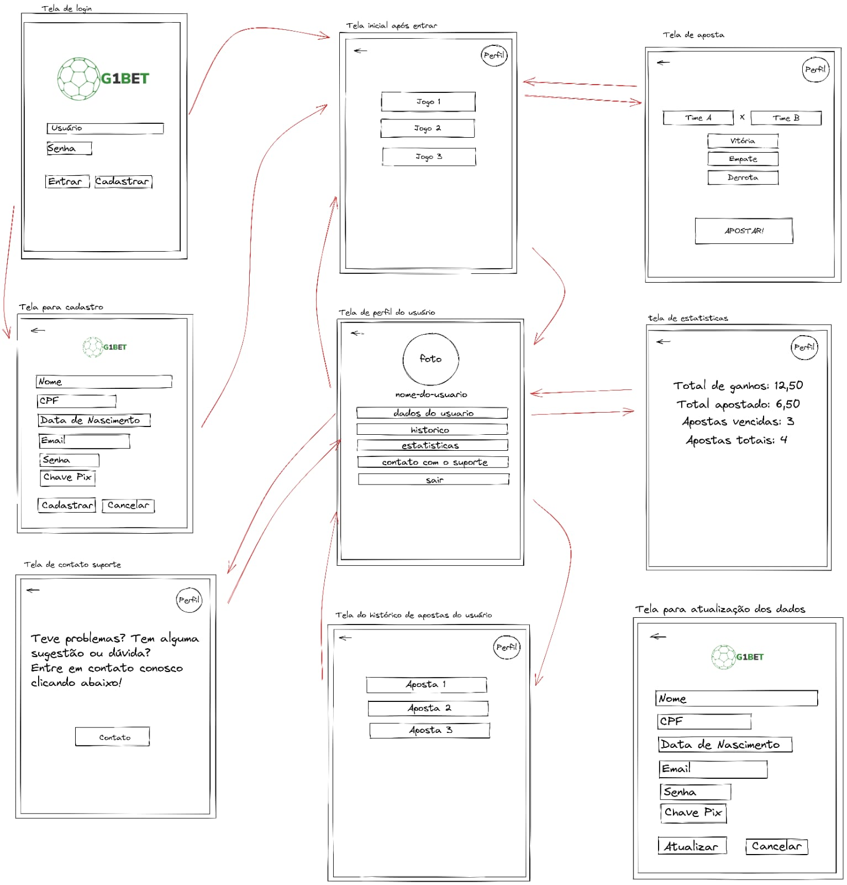

<h1 align="center">Protótipos</h1>

## Histórico de Versão

|    Data    | Versão |                Descrição                |                                                                                                  Ator(es)                                                                                                  |
| :--------: | :----: | :-------------------------------------: | :--------------------------------------------------------------------------------------------------------------------------------------------------------------------------------------------------------: |
| 14/10/2022 |  0.1   | Adiciona protótipos de baixa fidelidade | [Gabriel Marcolino](https://github.com/GabrielMR360), [Amanda Luiza](https://github.com/amandailg), [Carla Vitoria](https://github.com/Carla-Vitoria), [Júlio Batista](https://github.com/iamjuliobatista) |

## Protótipo de baixa fidelidade

### PC

### Mobile

## Fluxos

### **Fluxo de login**

- Usuário vai logar na plataforma.
- A partir da tela inicial ele pode ter dois caminhos:
    1. Entrar na plataforma com seu login.
    2. Cadastrar uma nova conta caso não tenha.

### **Fluxo de cadastro**

- Usuário preenche os campos obrigatórios para o cadastro.
- Após o preenchimento ele clica em cadastrar e entra na plataforma.
- Usuário pode cancelar a ação e voltar para tele de login.

### **Fluxo inicial**

- Usuário tem dois caminhos:
    1. Ir para seu perfil.
    2. Ir para a tela de apostas.
   
### **Fluxo aposta**

- Usuário seleciona o time em que ela deseja apostar e em seguida seleciona qual o tipo de aposta.
- Usuário pode voltar para tela inicial ou ver seu perfil.

### **Fluxo perfil**

- Usuário tem vários caminhos que podem ser seguidos:
    1. Atualizar dados do usuário.
    2. Exibir os histórico das suas apostas.
    3. Consultar as estatisticas do seu perfil.
    4. Contatar o suporte.
    5. Sair da conta.
- Usuário pode voltar para tela inicial.

### **Fluxo de atualizar dados**

- Usuário altera os dados que deseja e clica em atualiza para salvar as mudanças.
- Usuário pode cancelar a ação e voltar para tele do perfil.